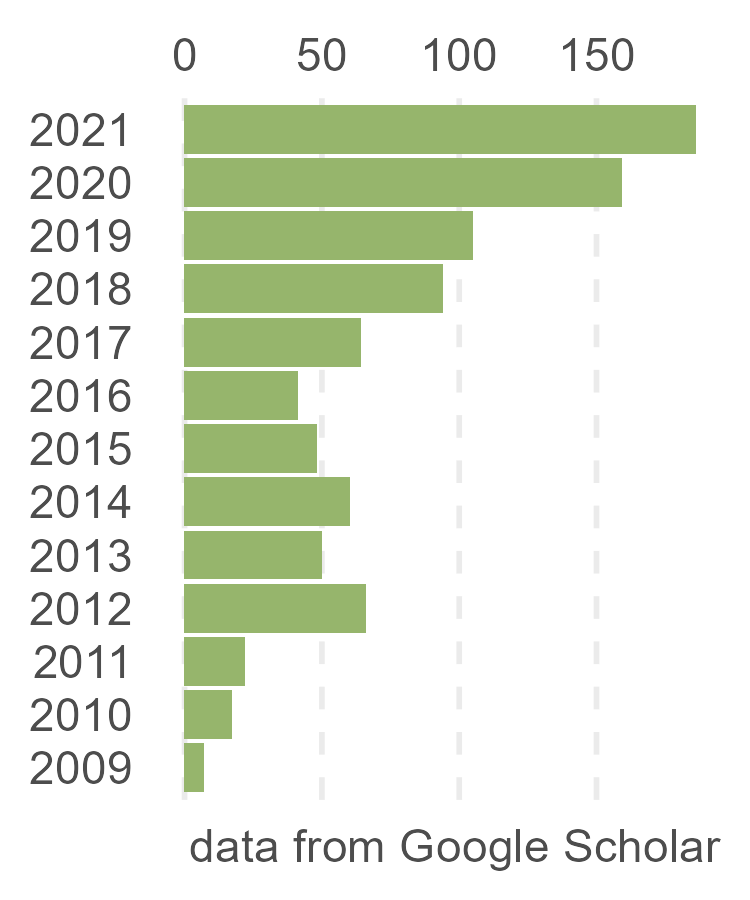

```{r, include=FALSE}
knitr::opts_chunk$set(
  results='asis', 
  echo = FALSE
)

# display Chinese
Sys.setlocale("LC_ALL","Chinese")
Sys.setenv(LANG = "zh_CN.UTF-8")


library(glue)
library(tidyverse)
library(bib2df)

# get pkg's url
CRANpkg <- function (pkg) {
    cran <- "https://CRAN.R-project.org/package"
    fmt <- "[%s](%s=%s)"
    sprintf(fmt, pkg, cran, pkg)
}

Biocpkg <- function (pkg) {
    sprintf("[%s](http://bioconductor.org/packages/%s)", pkg, pkg)
}


# Set this to true to have links turned into footnotes at the end of the document
PDF_EXPORT <- FALSE

# Holds all the links that were inserted for placement at the end
links <- c()

# find markdown links
find_link <- regex("
  \\[   # Grab opening square bracket
  .+?   # Find smallest internal text as possible
  \\]   # Closing square bracket
  \\(   # Opening parenthesis
  .+?   # Link text, again as small as possible
  \\)   # Closing parenthesis
  ",
  comments = TRUE)

#' transform markdown URL to HTML URL
sanitize_links <- function(text){
  if(PDF_EXPORT){
    str_extract_all(text, find_link) %>% 
      pluck(1) %>% 
      walk(function(link_from_text){
        # link title and target
        title <- link_from_text %>% str_extract('\\[.+\\]') %>% str_remove_all('\\[|\\]') 
        link <- link_from_text %>% str_extract('\\(.+\\)') %>% str_remove_all('\\(|\\)')
        
        # add link to links array
        links <<- c(links, link)
        
        # Build replacement text
        new_text <- glue('{title}<sup>{length(links)}</sup>')
        
        # Replace text
        text <<- text %>% str_replace(fixed(link_from_text), new_text)
      })
  }
  
  text
}


# Takes a single row of dataframe corresponding to a position
# turns it into markdown, and prints the result to console.
build_position_from_df <- function(pos_df){
  
  missing_start <- pos_df$start == 'N/A'
  dates_same <- pos_df$end == pos_df$start
  if (pos_df$end == 9999) {
    pos_df$end = "present"
  }
  if(any(c(missing_start,dates_same))){
    timeline <- pos_df$end
  } else {
    timeline <- glue('{pos_df$end} - {pos_df$start}')
  }

  descriptions <- pos_df[str_detect(names(pos_df), 'description')] %>% 
    as.list() %>% 
    map_chr(sanitize_links)
  
  # Make sure we only keep filled in descriptions
  description_bullets <- paste('-', descriptions[descriptions != 'N/A'], collapse = '\n')
  
  if (length(description_bullets) == 1 && description_bullets == "- ") {
    description_bullets <- ""
  }
  glue(
"### {sanitize_links(pos_df$title)}

{pos_df$loc}

{pos_df$institution}

{timeline}

{description_bullets}


"
  ) %>% print()
}

# Takes nested position data and a given section id 
# and prints all the positions in that section to console
print_section <- function(position_data, section_id){
  x <- position_data %>% 
    filter(section == section_id) %>% 
    pull(data) 
  
  prese <- " - "
  xx <- list()

  for (i in seq_along(x)) {    
      y = x[[i]]
      y <- cbind(y, start2 = as.character(y$start))
      y <- cbind(y, end2 = as.character(y$end))

      se <- paste(y$start, "-", y$end, collapse = " ")
      if (prese == se) {
        y$start2 = ""
        y$end2 = ""
      } else {
        prese = se
      }

    xx[[i]] <- select(y, -c(start, end)) %>%
      rename(start=start2, end=end2)
  }
    
  xx %>% 
    purrr::walk(build_position_from_df)
}


fill_nas <- function(column){
  ifelse(is.na(column), 'N/A', column)
}


# Construct a bar chart of skills
build_skill_bars <- function(skills, out_of = 5){
  bar_color <- "#d9d9d9"
  bar_background <- "#969696"
  skills %>% 
    mutate(width_percent = round(100*level/out_of)) %>% 
    glue_data(
      "<div class = 'skill-bar'",
      "style = \"background:linear-gradient(to right,",
      "{bar_color} {width_percent}%,",
      "{bar_background} {width_percent}% 100%)\" >",
      "{skill}",
      "</div>"
    )
}

# import publications from biotex
options(encoding="UTF-8")
publications <- bib2df("publications.bib")
publications$description_1 <- sapply(publications$AUTHOR,function(x){
  if (any(str_detect(x,"^[A-Z]"), na.rm = TRUE)){
    x <- str_replace_all(x,"Gao, Chun.*ui","**Gao, Chun-Hui**")
  } else {
    x <- str_replace_all(x,", ","") %>% str_replace_all("高春辉","__高春辉__")
  }
  paste(x,collapse = "; ")
})
pub_data <- publications %>% mutate(vol=ifelse(is.na(VOLUME),"",VOLUME),
                        issue=ifelse(is.na(NUMBER),"",paste("(",NUMBER,")",sep = "")),
                        pages=ifelse(is.na(PAGES),"",PAGES)) %>%
  mutate(vi=paste0(vol,issue)) %>%
  mutate(vip=ifelse(nchar(vi)==0,pages,paste(vi,pages,sep=":"))) %>%
  mutate(loc = ifelse(nchar(vip)==0, paste(paste0("__",JOURNAL,"__"),YEAR,sep = ", "), 
                      paste(paste0("__",JOURNAL,"__"), YEAR,vip, sep = ", ")),
         title = gsub("\\{|\\}","",TITLE),
         description_1=gsub("\\{|\\}","",description_1)) %>%
  mutate(title=ifelse(is.na(DOI),title,paste("[",title,"]","(http://doi.org/",DOI,")",sep = ""))) %>%
  mutate(institution=as.character(NA),
         start=YEAR,
         end=YEAR,
         description_2=as.character(NA),
         description_3=as.character(NA),
         order=as.character(NA),
         section="academic_articles",
         id=1:n()) %>%
  select(loc,title,institution,start,end,description_1,description_2,description_3,section,order) 


# Load csv with position info
# position_data <- read_csv('positions.csv',comment = "#") 
position_data <- openxlsx::read.xlsx("positions.xlsx") %>%
  filter(!stringr::str_detect(loc,"^#"))
position_data <- rbind(position_data,pub_data) %>% 
  mutate_all(fill_nas) %>% 
  arrange(order, desc(end)) %>% 
  mutate(id = 1:n()) %>% 
  nest(data = c(-id, -section))
```

```{r}
# When in export mode the little dots are unaligned, so fix that. 
if(PDF_EXPORT){
  cat("
  <style>
  :root{
    --decorator-outer-offset-left: -6.5px;
  }
  </style>")
}
```


Aside
================================================================================


{width=100%}

```{r}
# When in export mode the little dots are unaligned, so fix that. 
if(PDF_EXPORT){
  cat("View this CV online with links at _r.bio-spring.info/cv_")
}
```

Contact {#contact}
--------------------------------------------------------------------------------


- <i class="fa fa-envelope"></i> gaospecial@gmail.com
- <i class="fa fa-github"></i> [github.com/gaospecial](http://github.com/gaospecial)
- <i class="fa fa-weixin"></i> gaospecial
- <i class="fa fa-twitter"></i> [gaospecial](http://twitter.com/gaospecial)
- <i class="fa fa-link"></i> [bio-spring.top](http://bio-spring.top)
- <i class="fa fa-phone"></i> (86) 13147133164


Skills {#skills}
--------------------------------------------------------------------------------

```{r}
skills <- tribble(
  ~skill,               ~level,
  "Molecular microbiology", 5,
  "High-throughput sequencing",5,
  "Microbial ecology",      4,
  "Bioinformatics",         4,
  "Programing",             3.5,
  "Data visualization",     4.5,
)
build_skill_bars(skills)
```


Disclaimer {#disclaimer}
--------------------------------------------------------------------------------

View online version of this CV at [r.bio-spring.info/cv](https://r.bio-spring.info/cv/).

Made with the R package [**pagedown**](https://github.com/rstudio/pagedown). 

The source code is available at [github.com/gaospecial/cv](https://github.com/gaospecial/cv).

Last updated on `r Sys.Date()`.

<br>
<br>

Main
================================================================================

Chun-Hui Gao (高春辉) {#title}
--------------------------------------------------------------------------------

Ph. D, Microbiology, bioinformatician, data scientist and R user. 

I am broadly interested in the data mining, particularly integration and visualization, 
of biological, industrial and social datasets, which comes from high-throughput screening, 
Next-Generation Sequqncing (NGS), public databases and so on.


Work Experience {data-icon=laptop}
--------------------------------------------------------------------------------

```{r, results='asis', echo = FALSE}
print_section(position_data, 'research_positions')
```


Education {data-icon=graduation-cap data-concise=true}
--------------------------------------------------------------------------------

```{r, results='asis', echo = FALSE}
print_section(position_data, 'education')
```

<div style="page-break-after: always; visibility: hidden"> 
\pagebreak 
</div>

Research Summary {#summary data-icon=flask}
--------------------------------------------------------------------------------

::: aside

**Professional Competence**

Microbiology

- Transcriptional regulator
- Drug resistance
- Pathogenisis
- Persistance

Microbial ecology

- Social interaction
- Co-culture
- Multispecies biofilm

NGS

- (meta-)Genomics
- (meta-)RNA-seq
- Microbiome
- ChIP-seq

Bioinformatics

- Linux
- Perl
- R

Visualization

- ggplot2
- ggVennDiagram
- Reproducible research

Skills

- Write R package
- Statistics
- Illustration
- Bibliometric
- Data mining

:::

### Whole genome protein-protein and TF-promoter interactome in *M. tuberculosis*

College of Life Science and Technology

Huazhong Agricultural University

2007 - 2009

We used a bacterial two-hybrid method to construct the whole genome protein-protein interaction (PPI) network, and a bacterial one-hybrid method to construct the whole genome transcriptional regulator (TF) - promoter interaction network in *M. tuberculosis*.

### Novel transcriptional regulator in mycobacteria

College of Life Science and Technology

Huazhong Agricultural University

2009 - 2012

- An ArsR-like transcriptional factor recognizes a conserved sequence motif and positively regulates the expression of *phoP* in mycobacteria
- A TetR-like regulator broadly affects the expressions of diverse genes in *Mycobacterium smegmatis*
- Characterization of a Novel ArsR-Like Regulator Encoded by Rv2034 in *Mycobacterium tuberculosis*

### The intra-action between three RelBE modules and inter-action between RelBE3/SirR

College of Life Science and Technology

Huazhong Agricultural University

2009 - 2014

- Characterization of the Interaction and Cross-Regulation of Three Mycobacterium tuberculosis RelBE Modules.
- Characterization of the interaction between a SirR family transcriptional factor of *Mycobacterium tuberculosis*, encoded by Rv2788, and a pair of toxin-antitoxin proteins RelJ/K, encoded by Rv3357 and Rv3358.

### The regulation of secondary metabolite (ε-poly lysine) biosynthesis in *Streptomyces albus* ZPM

School of Life Science

University of Science and Technology of China

2013 - 2014

- Identification of genetic variations associated with epsilon-poly-lysine biosynthesis in *Streptomyces albulus* ZPM by genome sequencing.


### The distribution of type III-A CRISPR-Cas system in *Staphylococcus aureus* clinical isolates

School of Life Science

University of Science and Technology of China

2014 - 2015

- Identification and functional study of type III-A CRISPR-Cas systems in clinical isolates of *Staphylococcus aureus*.


### The regulatory mechanism of drug susceptibility in mycobacteria

State Key Laboratory of Agricultural Microbiology

Huazhong Agricultural University

2012 - 2019


- InbR, a TetR family regulator, binds with isoniazid and influences multidrug resistance in *Mycobacterium bovis* BCG
- OxiR specifically responds to isoniazid and regulates isoniazid susceptibility in mycobacteria
- Cross-talk between the three furA orthologs in *Mycobacterium smegmatis* and the contribution to isoniazid resistance


### Unearthing the mechanism of soil biofilms

College of Resources and Environment

Huazhong Agricultural University

2016 - 2021

- The initial inoculation ratio regulates bacterial coculture interactions and metabolic capacity
- *Bacillus subtilis* biofilm development in the presence of soil clay minerals and iron oxides
- Co-culture of soil biofilm isolates enables the discovery of novel antibiotics
- Divergent Influence to a Pathogen Invader by Resident Bacteria with Different Social Interactions
- Soil biofilms: microbial interactions, challenges, and advanced techniques for *ex-situ* characterization
- Impact of metal oxide nanoparticles on in vitro DNA amplification


<br>


Teaching Experience {data-icon=chalkboard-teacher}
--------------------------------------------------------------------------------


```{r}
print_section(position_data, 'teaching_positions')
```

<div style="page-break-after: always; visibility: hidden"> 
\pagebreak 
</div>

Conferences {data-icon=group}
--------------------------------------------------------------------------------

## Oral presentations {data-icon=comment}

```{r}
print_section(position_data, 'presentation')
```


## Conference abstract  {data-icon=book-open}


```{r}
print_section(position_data, 'conference_abstract')
```

## Conference participation {data-icon=id-badge}

```{r}
print_section(position_data, "present")
```


```{r}
if(PDF_EXPORT){
  cat("
  
Links {data-icon=link}
--------------------------------------------------------------------------------


")
  
  walk2(links, 1:length(links), function(link, index){
    print(glue('{index}. {link}'))
  })
}
```

<br>


School Honors {data-icon=crown}
--------------------------------------------------------------------------------


```{r}
print_section(position_data, 'honor')
```

<div style="page-break-after: always; visibility: hidden"> 
\pagebreak 
</div>

Publifications {data-icon=book}
--------------------------------------------------------------------------------


::: aside

```{r}
profile = jsonlite::fromJSON(xfun::read_utf8("profile.json"))

  glue(

"
+ Citation = {profile$total_cites}
+ H-index = {profile$h_index}
+ I10-index = {profile$i10_index}

"
  ) %>% print()

```


:::


```{r}
print_section(position_data, 'academic_articles')
```