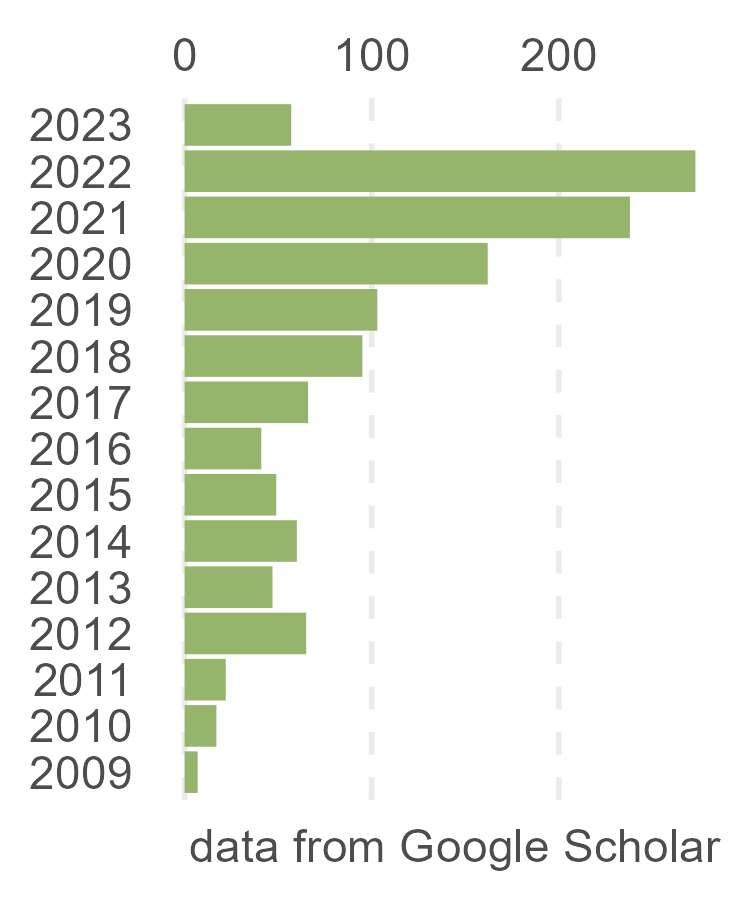

```{r, include=FALSE}
knitr::opts_chunk$set(
  results='asis', 
  echo = FALSE
)

# display Chinese
Sys.setlocale("LC_ALL","Chinese")
Sys.setenv(LANG = "zh_CN.UTF-8")


library(glue)
library(tidyverse)
library(bib2df)

# get pkg's url
CRANpkg <- function (pkg) {
    cran <- "https://CRAN.R-project.org/package"
    fmt <- "[%s](%s=%s)"
    sprintf(fmt, pkg, cran, pkg)
}

Biocpkg <- function (pkg) {
    sprintf("[%s](http://bioconductor.org/packages/%s)", pkg, pkg)
}


# Set this to true to have links turned into footnotes at the end of the document
PDF_EXPORT <- FALSE

# Holds all the links that were inserted for placement at the end
links <- c()

# find markdown links
find_link <- regex("
  \\[   # Grab opening square bracket
  .+?   # Find smallest internal text as possible
  \\]   # Closing square bracket
  \\(   # Opening parenthesis
  .+?   # Link text, again as small as possible
  \\)   # Closing parenthesis
  ",
  comments = TRUE)

#' transform markdown URL to HTML URL
sanitize_links <- function(text){
  if(PDF_EXPORT){
    str_extract_all(text, find_link) %>% 
      pluck(1) %>% 
      walk(function(link_from_text){
        # link title and target
        title <- link_from_text %>% str_extract('\\[.+\\]') %>% str_remove_all('\\[|\\]') 
        link <- link_from_text %>% str_extract('\\(.+\\)') %>% str_remove_all('\\(|\\)')
        
        # add link to links array
        links <<- c(links, link)
        
        # Build replacement text
        new_text <- glue('{title}<sup>{length(links)}</sup>')
        
        # Replace text
        text <<- text %>% str_replace(fixed(link_from_text), new_text)
      })
  }
  
  text
}


# Takes a single row of dataframe corresponding to a position
# turns it into markdown, and prints the result to console.
build_position_from_df <- function(pos_df){
  
  missing_start <- pos_df$start == 'N/A'
  dates_same <- pos_df$end == pos_df$start
  if (pos_df$end == 9999) {
    pos_df$end = "present"
  }
  if(any(c(missing_start,dates_same))){
    timeline <- pos_df$end
  } else {
    timeline <- glue('{pos_df$end} - {pos_df$start}')
  }

  descriptions <- pos_df[str_detect(names(pos_df), 'description')] %>% 
    as.list() %>% 
    map_chr(sanitize_links)
  
  # Make sure we only keep filled in descriptions
  description_bullets <- paste('-', descriptions[descriptions != 'N/A'], collapse = '\n')
  
  if (length(description_bullets) == 1 && description_bullets == "- ") {
    description_bullets <- ""
  }
  glue(
"### {sanitize_links(pos_df$title)}

{pos_df$loc}

{pos_df$institution}

{timeline}

{description_bullets}


"
  ) %>% print()
}

# Takes nested position data and a given section id 
# and prints all the positions in that section to console
print_section <- function(position_data, section_id){
  x <- position_data %>% 
    filter(section == section_id) %>% 
    pull(data) 
  
  prese <- " - "
  xx <- list()

  for (i in seq_along(x)) {    
      y = x[[i]]
      y <- cbind(y, start2 = as.character(y$start))
      y <- cbind(y, end2 = as.character(y$end))

      se <- paste(y$start, "-", y$end, collapse = " ")
      if (prese == se) {
        y$start2 = ""
        y$end2 = ""
      } else {
        prese = se
      }

    xx[[i]] <- select(y, -c(start, end)) %>%
      rename(start=start2, end=end2)
  }
    
  xx %>% 
    purrr::walk(build_position_from_df)
}


fill_nas <- function(column){
  ifelse(is.na(column), 'N/A', column)
}


# Construct a bar chart of skills
build_skill_bars <- function(skills, out_of = 5){
  bar_color <- "#969696"
  bar_background <- "#d9d9d9"
  skills %>% 
    mutate(width_percent = round(100*level/out_of)) %>% 
    glue_data(
      "<div class = 'skill-bar'",
      "style = \"background:linear-gradient(to right,",
      "{bar_color} {width_percent}%,",
      "{bar_background} {width_percent}% 100%)\" >",
      "{skill}",
      "</div>"
    )
}

# import publicatio from biotex
options(encoding="UTF-8")
publications <- bib2df("publications.bib")
options(encoding="")
publications$description_1 <- sapply(publications$AUTHOR,function(x){
  if (any(str_detect(x,"^[A-Z]"))){
    x <- str_replace_all(x,"Gao, Chun.*ui","**Gao, Chun-Hui**")
  } else {
    x <- str_replace_all(x,", ","") %>% str_replace_all("高春辉","__高春辉__")
  }
  paste(x,collapse = "; ")
})
pub_data <- publications %>% mutate(vol=ifelse(is.na(VOLUME),"",VOLUME),
                        issue=ifelse(is.na(NUMBER),"",paste("(",NUMBER,")",sep = "")),
                        pages=ifelse(is.na(PAGES),"",PAGES)) %>%
  mutate(vi=paste0(vol,issue)) %>%
  mutate(vip=ifelse(nchar(vi)==0,pages,paste(vi,pages,sep=":"))) %>%
  mutate(loc = ifelse(nchar(vip)==0, YEAR, paste(YEAR,vip, sep = ", ")),
         title = gsub("\\{|\\}","",TITLE),
         description_1=gsub("\\{|\\}","",description_1)) %>%
  mutate(title=ifelse(is.na(DOI),title,paste("[",title,"]","(http://doi.org/",DOI,")",sep = ""))) %>%
  mutate(institution=as.character(NA),
         start=YEAR,
         end=YEAR,
         description_2=as.character(NA),
         description_3=as.character(NA),
         order=as.character(NA),
         section="academic_articles",
         id=1:n()) %>%
  select(loc,title,institution,start,end,description_1,description_2,description_3,section,order) 


# Load csv with position info
position_data <- read_csv('positions.csv',comment = "#") 
position_data <- rbind(position_data,pub_data) %>% 
  mutate_all(fill_nas) %>% 
  arrange(order, desc(end)) %>% 
  mutate(id = 1:n()) %>% 
  nest(data = c(-id, -section))
```

```{r}
# When in export mode the little dots are unaligned, so fix that. 
if(PDF_EXPORT){
  cat("
  <style>
  :root{
    --decorator-outer-offset-left: -6.5px;
  }
  </style>")
}
```


Aside
================================================================================


{width=100%}

```{r}
# When in export mode the little dots are unaligned, so fix that. 
if(PDF_EXPORT){
  cat("View this CV online with links at _bio-spring.info/cv_")
}
```

Contact {#contact}
--------------------------------------------------------------------------------


- <i class="fa fa-envelope"></i> gaospecial@gmail.com
- <i class="fa fa-github"></i> [github.com/gaospecial](http://github.com/gaospecial)
- <i class="fa fa-weixin"></i> gaospecial
- <i class="fa fa-twitter"></i> [gaospecial](http://twitter.com/gaospecial)
- <i class="fa fa-link"></i> [bio-spring.info](http://bio-spring.info)
- <i class="fa fa-phone"></i> (86) 13147133164


Skills {#skills}
--------------------------------------------------------------------------------

```{r}
skills <- tribble(
  ~skill,               ~level,
  "Molecular microbiology", 5,
  "High-throughput sequencing",5,
  "Microbial ecology",      4,
  "Bioinformatics",         4,
  "Programing",             3.5,
  "Data visualization",     4.5,
)
build_skill_bars(skills)
```


Disclaimer {#disclaimer}
--------------------------------------------------------------------------------

Made with the R package [**pagedown**](https://github.com/rstudio/pagedown). 

The source code is available at [github.com/gaospecial/cv](https://github.com/gaospecial/cv).

Last updated on `r Sys.Date()`.

<br>
<br>

Main
================================================================================

Chun-Hui Gao (高春辉) {#title}
--------------------------------------------------------------------------------

Ph. D, Microbiology, bioinformatician, data scientist and R user. 

I am broadly interested in the data mining, particularly integration and visualization, 
of biological, industrial and social datasets, which comes from high-throughput screening, 
Next-Generation Sequqncing (NGS), public databases and so on.


Research Experience {data-icon=laptop}
--------------------------------------------------------------------------------

```{r, results='asis', echo = FALSE}
print_section(position_data, 'research_positions')
```


Education {data-icon=graduation-cap data-concise=true}
--------------------------------------------------------------------------------

```{r, results='asis', echo = FALSE}
print_section(position_data, 'education')
```

<br>


Research Summary {#summary data-icon=laptop}
--------------------------------------------------------------------------------

2007年9月至2012年6月，本人在“长江学者”何正国教授领衔的课题组中从事病原微生物的研究。硕士阶段，主要参与了结核分枝杆菌的全基因组转录调控网络和全基因组蛋白质相互作用网络的构建；在读博士期间，主要研究结核分枝杆菌重要基因组的转录调控机制，结合使用生物化学、分子生物学和生物信息学的研究方法，先后发现了ArsR、TetR和FurA类型的转录因子，分别对于分枝杆菌的潜伏持续感染、全局调控和抗药性有明显贡献。

期间，还研究了结核分枝杆菌RelBE毒素抗毒素系统系统之间的交叉蛋白质相互作用，以及RelBE3（即RelJK）与SirR转录调控蛋白的相互作用。

2015年至今，在回到华中农业大学之后，与该校生命科学技术学院杨敏副教授合作，继续开展结核分枝杆菌转录调控蛋白与药物小分子相互作用的研究，先后鉴定了InbR、FurA、OxiR等与细菌药物敏感性相关的功能基因。

2016年至今，在华中农业大学资源与环境学院担任师资博士后，在“青年长江学者”蔡鹏教授的指导下，主要采用共培养、（宏）多组学和生物信息学方法研究土壤微生物分离株或模式微生物之间的相互作用，解析其互作的分子和生态学机制。

同期，还完成了一例金属纳米颗粒影响体外DNA复制的研究，发表研究论文一篇。


<br>


Teaching Experience {data-icon=chalkboard-teacher}
--------------------------------------------------------------------------------


```{r}
print_section(position_data, 'teaching_positions')
```


<br>


Conference proceedings {data-icon=group}
--------------------------------------------------------------------------------


```{r}
print_section(position_data, 'presentation')
```


```{r}
if(PDF_EXPORT){
  cat("
  
Links {data-icon=link}
--------------------------------------------------------------------------------


")
  
  walk2(links, 1:length(links), function(link, index){
    print(glue('{index}. {link}'))
  })
}
```

<br>

::: aside

Professional Competence {#skills}
--------------------------------------------------------------------------------

Microbiology

- Transcriptional regulator
- Drug resistance
- Pathogenisis
- Persistance

Microbial ecology

- Social interaction
- Co-culture
- Multispecies biofilm

Pathogens

- *Mycobacterium tuberculosis*
- *Vibrio parahaemolyticus*
- *Staphylococcus aureus*

Commensal

- *Mycobacterium smegmatis*
- *Staphylococcus epidermidis*
- *Psuedomonas fluorescens*
- *Pseudomonas putida*
- *Bacillus subtilis*
- *Streptomyces albus*

NGS

- (meta-)Genomics
- (meta-)RNA-seq
- Microbiome
- ChIP-seq

Bioinformatics

- Linux
- Perl
- R

Visualization

- ggplot2
- ggVennDiagram
- Reproducible research

Skills

- Write R package
- Statistics
- Illustration
- Bibliometric
- Data mining

:::


Publifications {data-icon=book}
--------------------------------------------------------------------------------


::: aside

```{r}
profile = jsonlite::fromJSON("profile.json")

  glue(

"
+ Citation = {profile$total_cites}
+ H-index = {profile$h_index}
+ I10-index = {profile$i10_index}

"
  ) %>% print()

```


:::


```{r}
print_section(position_data, 'academic_articles')
```